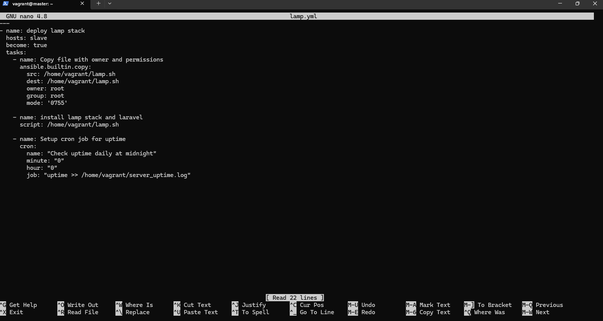
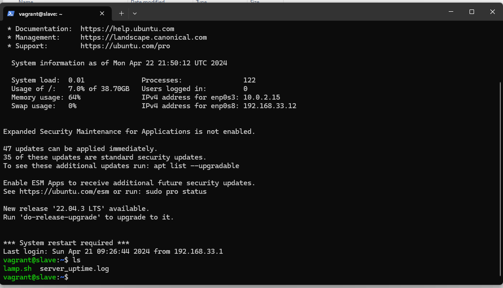
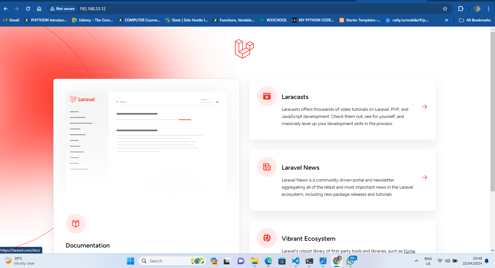

# Altschool_-Second_Semester_Examination
# NAME : ABUBAKAR AYOMIDE MICHEAL 
# Student ID: ALT/SOE/023/2451

# Second Semester Exam

## (Deploy LAMP Stack)

## Objective:

- Automate the provisioning of two Ubuntu-based servers, named “Master” and “Slave”, using Vagrant.
- On the Master node, create a bash script to automate the deployment of a LAMP (Linux, Apache, MySQL, PHP) stack.
- This script should clone a PHP application from GitHub, install all necessary packages, and configure Apache web server and MySQL.
- Ensure the bash script is reusable and readable.

Using an Ansible playbook:

- Execute the bash script on the Slave node and verify that the PHP application is accessible through the VM’s IP address (take screenshot of this as evidence)
- Create a cron job to check the server’s uptime every 12 am.

## Overview Of Task Execution

- In this Document i'll outline the steps required to deploy a PHP Laravel application using Ansible and Bash Script ensuring Accessibility.

- Ansible Communicates with slave node using SSH connection

## Tasks:

### - Bash Script:

1. Write Bash script to provision slave node with all neccessary dependencies required to deploy a Php Laravel Application (Installing LAMP stack)

2. Install Composer: Composer is used to setup PHP project by installing the neccessary depending required to run app

3. Cloning official Laravel Github Repo

4. Setup MySql Server (Create User and Database)

5. Setup Apache Virtual Host

laravel_app.sh

#!/bin/bash

# sudo apt update
# Function to display messages in gold
gold_echo() {
    echo -e "\e[38;5;220m$@\e[0m"
}

function install_lamp() {
# Install PHP
gold_echo "---------------------update php repository-----------------------"

 sudo apt update
 sudo add-apt-repository ppa:ondrej/php -y

gold_echo "-----------------------Installing Php8.2-----------------------------------------"
 sudo apt install php8.2 -y

gold_echo "-------------------------------------Installing php dependencies----------------------------"

 sudo apt install php8.2-curl php8.2-dom php8.2-mbstring php8.2-xml php8.2-mysql zip unzip -y

gold_echo "-------------------------- php done ----------------------------------"

#Install Apache web server

gold_echo "----------------------------Installing Apache--------------------------------------------------"

 sudo apt install apache2 -y
 sudo apt update
 sudo systemctl restart apache2

#Install Mysql-server

gold_echo "------------------------------------Installing mysql-server----------------------------------------------"

 sudo apt install mysql-server -y
}

 composer_setup() {
 cd ~
 gold_echo "-----------------------Back Home -> ( "$HOME") ->  Checking if composer directory has been created---------------------"

 if [ -d "$HOME/composer" ]; then

         gold_echo "--------------------------------------Composer Directory Exists--------------------------------------------"
 else
   mkdir composer
   cd composer

   gold_echo "-------------------Directory created successfully--------------------------------"

   curl -sS https://getcomposer.org/installer | php
   sudo mv composer.phar /usr/local/bin/composer

   gold_echo "------------------- Composer Added Successfully-------------------------"
 fi
}

 setup_laravel_app() {
 cd /var/www/

 sudo rm -r ./*
 sudo git clone https://github.com/laravel/laravel
 sudo chown -R $USER:$USER laravel
 cd laravel
#Install dependencies using composer
 composer install
 cp .env.example .env
 php artisan key:generate
 sudo chown -R www-data bootstrap/cache
 sudo chown -R www-data storage

}

conf_mysql() {
   cd /var/www/laravel

   gold_echo "-------------Setup mysql database and user--------------------------------"

# Configure MySQL database
sudo mysql -uroot -e "CREATE DATABASE Victor;"
sudo mysql -uroot -e "CREATE USER 'Ayo'@'localhost' IDENTIFIED BY 'Joseph';"
sudo mysql -uroot -e "GRANT ALL PRIVILEGES ON laravel_db.* TO 'laravel_user'@'localhost';"
sudo mysql -uroot -e "FLUSH PRIVILEGES;"

gold_echo "-----------------Done with database setup--------------"
gold_echo "------------------Editing .env file--------------------"

   sed -i 's/DB_CONNECTION=sqlite/DB_CONNECTION=mysql/' .env
   sed -i 's/# DB_HOST=127.0.0.1/DB_HOSTS=127.0.0.1/' .env
   sed -i 's/# DB_PORT=3306/DB_PORT=3306/' .env
   sed -i 's/# DB_DATABASE=laravel/DB_DATABASE=Victor/' .env
   sed -i 's/# DB_USERNAME=root/DB_USERNAME=Ayo/' .env
   sed -i 's/# DB_PASSWORD=/DB_PASSWORD=Joseph/' .env

   gold_echo "--------------------Clearing Cache (php artisan cache)------------------"
   php artisan cache:clear
   gold_echo "--------------------Clearing Config(php artisan config)------------------"
   php artisan config:clear

gold_echo "-------Migrating database--------"

   php artisan migrate

}

apache_conf() {
    #Setup Virtual host for app
    cd ~
    sudo tee /etc/apache2/sites-available/laravel.conf <<EOF
    <VirtualHost *:80 *:3000>
    ServerAdmin webmaster@localhost
    DocumentRoot /var/www/laravel/public/

    <Directory /var/www/laravel/public/>
            Options Indexes FollowSymLinks
            AllowOverride All
            Require all granted
    </Directory>

    ErrorLog ${APACHE_LOG_DIR}/error.log
    CustomLog ${APACHE_LOG_DIR}/access.log combined
  </VirtualHost>
EOF

  cd ~
   sudo a2dissite 000-default.conf
   sudo a2enmod rewrite
   sudo a2ensite laravel.conf
   sudo systemctl restart apache2
}

#Functions
main() {
install_lamp
composer_setup
setup_laravel_app
conf_mysql
apache_conf
}

#Execute All Functions
main

### - Ansible playbook

1. Copy script to slave node lamp.sh

2. Setup Cron to Check Server Up-Time Every 12AM

3. Check PHP Application Accessibility

lamp.yml

---
- name: deploy lamp stack
  hosts: slave
  become: true
  tasks:
    - name: Copy file with owner and permissions
      ansible.builtin.copy:
        src: /home/vagrant/lamp.sh
        dest: /home/vagrant/lamp.sh
        owner: root
        group: root
        mode: '0755'

    - name: install lamp stack and laravel
      script: /home/vagrant/lamp.sh

    - name: Setup cron job for uptime
      cron:
        name: "Check uptime daily at midnight"
        minute: "0"
        hour: "0"
        job: "uptime >> /home/vagrant/server_uptime.log"

## Master Node

## >> Play >>
)

## Slave Node
)

## Live View of Laravel App
)
